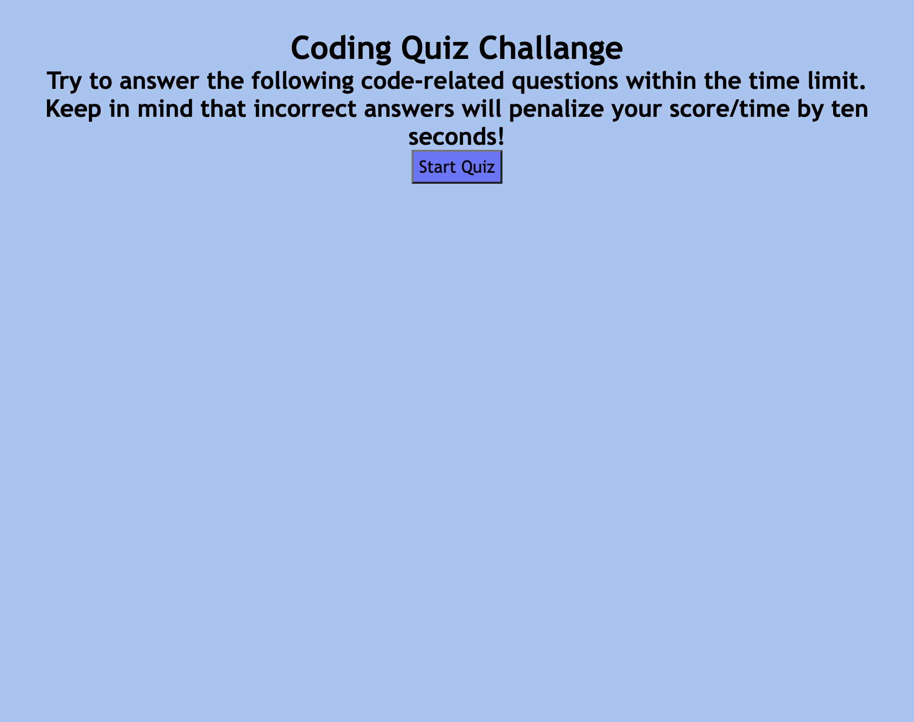
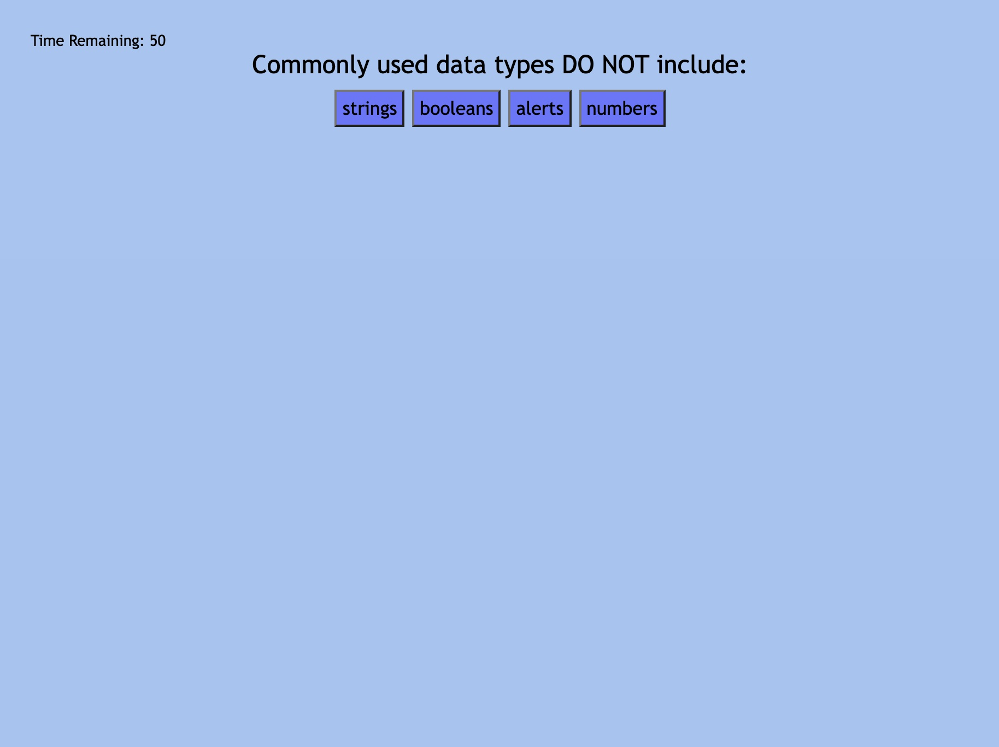

# Password-Generator

## Description

In this project, I present a coding quiz set with a timer and archived highscores. This project is not only great to test your knowledge on some Javascript basics, but has provided me practice with functions, event listeners, time intervals, arrays, and more. 

## Visuals

## Link

Link to Repository : https://github.com/giovannaruggio/coding-assessment

Link to Deployed Application : https://giovannaruggio.github.io/coding-assessment/